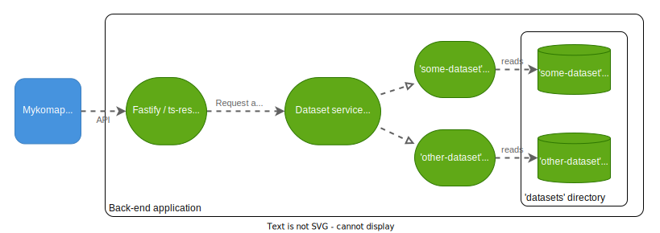

# Architecture diagrams

## System architecture


## Front-end architecture


### Notes

- We try to adhere to the Redux principle of having a [single source of truth](https://redux.js.org/understanding/thinking-in-redux/three-principles#single-source-of-truth).

- We create a plain MapLibreGL component and use its API directly, rather than using a binding such as `react-map-gl`. Although this
  would integrate more nicely with React and Redux hooks, it adds overhead and we can't guarantee that the binding library will always be
  maintained. Instead, we simply pass marker data and MapLibre click events through a MapWrapper React component. It is possible to avoid using a wrapper and
  subscribe to the Redux store without React, but this would be more complicated.

## Back-end architecture



### Dataset files

All persistent data is stored on the back-end server as JSON files, in the following folder structure
as seen from the SERVER_DATA_ROOT location:

```
├── datasets
│   ├── some-dataset
│   │   ├── locations.json (array of lng-lat coordinates for each initiative)
│   │   ├── searchable.json (array of the property values and searchable strings for each initiative)
│   │   ├── initiatives
│   │   |   ├── 0.json (full info of first initiative in the above aggregate JSONs)
│   │   |   ├── 1.json
│   │   |   ├── ...
│   ├── other-dataset
│   │   ├── ...
│   ├── ...
```

Additionally, for each dataset there's a `config.json`. This contains config for displaying the map
in the UI, including the vocabs (translations of data IDs), default sidebar panel, and popup
appearance. This config is not generated into the above folder structure, but kept in source control
in the `@mykomap/config` library.

### Example file contents

`locations.json`:

```
[ [1.21419, 50.45254], [0.21002, 49.33954], … ]
```

`searchable.json`:

```
{
  "fields": ["coun", "sz", "searchString"],
  "values": [
    ["GB", "Small", "some co-op 2 green lane london n4 9qr"],
    ["GB", "Large", "another co-op 15 brown street sheffield s7 0hg"],
    ...
  ]
}
```

#### Potential optimisation:

Since there will be one row per item, with 100k items, every 10 characters adds a new megabyte. The really bulky bit is the text searchString part, so maybe it could be kept in its own plain text file, with one line per item. Searching it could be done by streaming it from disk, which avoids loading the entire file permanently into memory (for each dataset).

For instance, this [SO thread](https://stackoverflow.com/questions/20187145/how-to-search-stream-for-string-in-node-js) has some sample stream-searching code, and a reference to a module which performs the streaming by what appears to be a fast non-buffering algorithm.

`0.json`:

```
{ name: "Some Co-op", "desc": "A co-op that sells stuff", "lng": 1.21419, "lat": 50.45254, "coun": "GB", "sz": "Small", ... }
```

`config.json`:

```
{
  "prefixes": {
    "https://example.com/sizes/1.1/": "sz",
    ...
  },
  "vocabs": {
    "sz": {
      "EN": {
        "title": "Sizes",
        "terms": {
          "large": "Large",
          "medium": "Medium",
          "small": "Small"
        }
      }
    },
    ...
  },
  "popupFields": {
    "sz": "text",
    "websites": "clickable-list",
    ...
  },
  "ui": { ... },
  ...
}

```

### Data generation

These directories of JSONs, including the searchable strings in the `searchable.json` files, need to be pre-generated by a script. This script will be written in JS/TS and live in the monorepo, to be run on the back-end server.

The script will take the full data CSV for a map (generated by the data factory) as inputs, and write the full data into the required JSON files in the directory structure specified above.

#### Note:

We will need to manually copy the `standard.csv` from the data factory server to the back-end. Maybe in the future, the data factory pipeline can be enhanced to write the JSON files to the back-end server so that no manual duplication is necessary (and maybe we can eventually get rid of the separate data server altogether). Or, the bacl-end server could be given a URL to the appropriate `standard.csv` file(s) as published by the data factory and download it from there as part of a `build-data` script (possibly when notified by a webhook, or possibly polling and checking the file modification date)

### Dataset instances

- For each dataset available in the `datasets` directory on server start, a dataset instance is created
  by the Dataset service. Each Dataset instance has a:
  - `searchable` property, which is just the `searchable.json` loaded as an in-memory object
  - `getItem` method
  - `getConfig` method, which includes the vocabs
  - `getLocations` method, which returns a stream of the data
  - `search` method, which involves iterating through `searchable` to find matching initiatives
