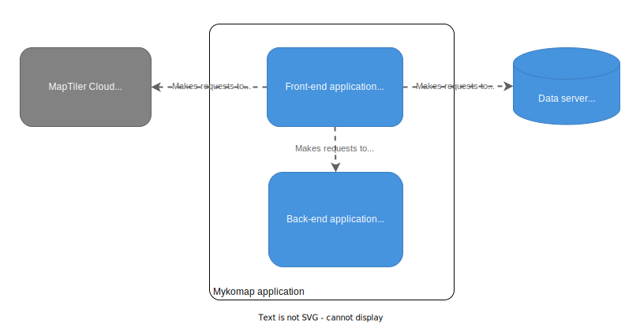
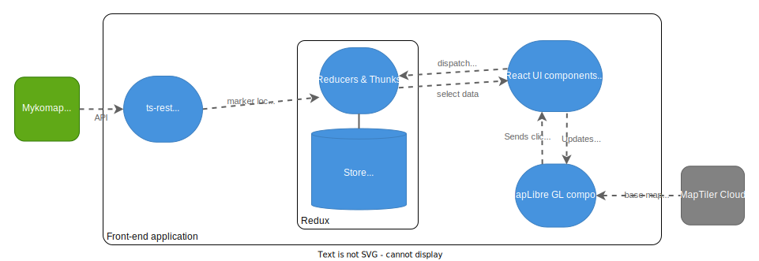

# Architecture diagrams

## System architecture

## Front-end architecture

### Notes

- We try to adhere to the Redux principle of having a [single source of truth](https://redux.js.org/understanding/thinking-in-redux/three-principles#single-source-of-truth).

- We create a plain MapLibreGL component and use its API directly, rather than using a binding such as `react-map-gl`. Although this
  would integrate more nicely with React and Redux hooks, it adds overhead and we can't guarantee that the binding library will always be
  maintained. Instead, we simply pass marker data and MapLibre click events through a MapWrapper React component. It is possible to avoid using a wrapper and
  subscribe to the Redux store without React, but this would be more complicated.

## Back-end architecture
