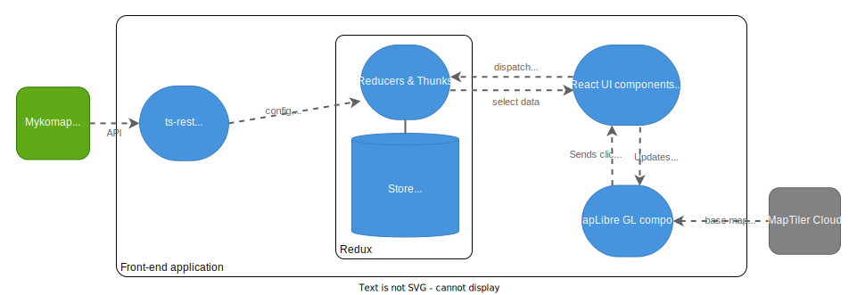

# Architecture

## Key requirements

Before diving in to the architecture, let's outline some key requirements & design decisions that led to this architecture.

- We need to display hundreds of thousands of markers, and for these to load as quickly as possible with a slow connection
- Searching and filtering the results must be fast

For these reasons, serving all the data straight to a front-end is not viable. In order to reduce loading times and computational load on the clients, we need a back-end that has access to all the data and can perform searches on it, then serves the front-end clients with the minimum required data it needs to render the UI.

> **_NOTE:_** In order to minimise the amount of data served to the front-end, we don't include dataset item IDs, only an array of their locations. Therefore the front-end generally refers to items by their array index. An item's index is persistent in the short term, e.g. within a single browser session, but can change when new data is loaded into the back-end. An item's ID is more stable, ideally permanent.

## System architecture


## Front-end architecture



### Notes

- We adhere to the Redux principle of having a [single source of truth](https://redux.js.org/understanding/thinking-in-redux/three-principles#single-source-of-truth). Breaking this principle is the biggest source of poor _spaghetti_ code and bugs. In practice, it means that before tracking any new state (i.e. any information/data served by the back-end or arising from a user action), pause and think:

  - Is this actually new state, or can it be derived from state that we are already storing somewhere?
  - If it is actually new state, where is the best place for it to live? This should be a single place. Usually it is the Redux store or, if it is contained within a single UI component and the rest of the app doesn't need to know about it, it can be internal React state within that component.

- We create a plain MapLibreGL component and use its API directly, rather than using a binding such as `react-map-gl`. Although this
  would integrate more nicely with React and Redux hooks, it adds overhead and we can't guarantee that the binding library will always be
  maintained. Instead, we simply pass marker data and MapLibre click events through a MapWrapper React component, as follows:
  - MapWrapper holds a reference to a MapLibre object. It can interact with this object to directly set the
    GeoJSON data that it renders. It sends custom events, including data, to the MapLibre object by calling `fire("eventName")` on the object.
  - The `mapLibre.ts` file holds the code internal to the MapLibre object. It can react to events fired by MapWrapper with the `map.on("eventName", callback)` listener. And it can fire events back to MapWrapper by calling the callbacks that were passed into the `createMap` function.

## Back-end architecture


### Dataset files

All persistent data is stored on the back-end server as JSON files, in the following folder structure
as seen from the SERVER_DATA_ROOT location:

```
├── datasets
│   ├── some-dataset
│   │   ├── config.json (itemProps, vocabs, UI config, languages, etc.)
│   │   ├── about.md (markdown file containing info to be displayed in AboutPanel)
│   │   ├── locations.json (array of lng-lat coordinates for each item)
│   │   ├── searchable.json (array of the property values and searchable strings for each item)
│   │   ├── items
│   │   |   ├── 0.json (full info of first item in the above aggregate JSONs)
│   │   |   ├── 1.json
│   │   |   ├── ...
│   ├── other-dataset
│   │   ├── ...
│   ├── ...
```

Note that the `config.json` for each dataset is kept in source control in the `@mykomap/config` library (to be implemented).

See the [`back-end test data`](https://github.com/DigitalCommons/mykomap-monolith/tree/main/apps/back-end/test/data/) for example file contents.

#### Potential optimisation:

The `searchable.json` will be loaded into the back-end server's memory. Since there will be one row per item, with 100k items, every 10 characters adds a new megabyte. The really bulky bit is the text searchString part, so maybe it could be kept in its own plain text file, with one line per item. Searching it could be done by streaming it from disk, which avoids loading the entire file permanently into memory (for each dataset).

For instance, this [SO thread](https://stackoverflow.com/questions/20187145/how-to-search-stream-for-string-in-node-js) has some sample stream-searching code, and a reference to a module which performs the streaming by what appears to be a fast non-buffering algorithm.

### Data generation

These directories of JSONs, including the searchable strings in the `searchable.json` files, need to be pre-generated by a script. This script will be written in JS/TS and live in the monorepo, to be run on the back-end server.

The script will take the full data CSV for a map (generated by the data factory) as inputs, and write the full data into the required JSON files in the directory structure specified above.

#### Note:

We will need to manually copy the `standard.csv` from the data factory server to the back-end. Maybe in the future, the data factory pipeline can be enhanced to write the JSON files to the back-end server so that no manual duplication is necessary (and maybe we can eventually get rid of the separate data server altogether). Or, the bacl-end server could be given a URL to the appropriate `standard.csv` file(s) as published by the data factory and download it from there as part of a `build-data` script (possibly when notified by a webhook, or possibly polling and checking the file modification date)

### Dataset instances

- For each dataset available in the `datasets` directory on server start, a dataset instance is created
  by the Dataset service. Each Dataset instance has a:

  - `getItem` method
  - `getConfig` method, which includes the vocabs
  - `getAbout` method
  - `getLocations` method, which returns a stream of the data
  - `search` method, which iterates through the data loaded from `searchable.json` to find matching items
